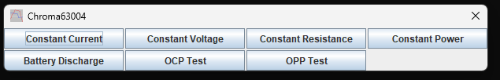
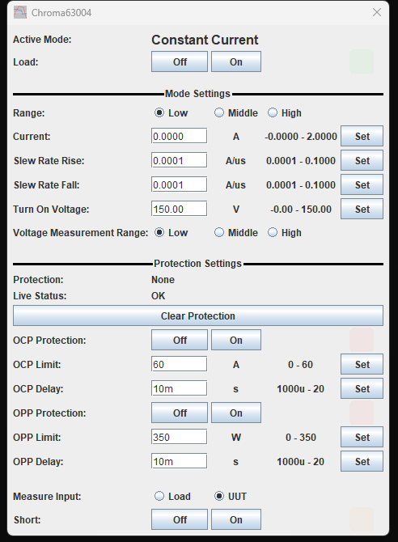
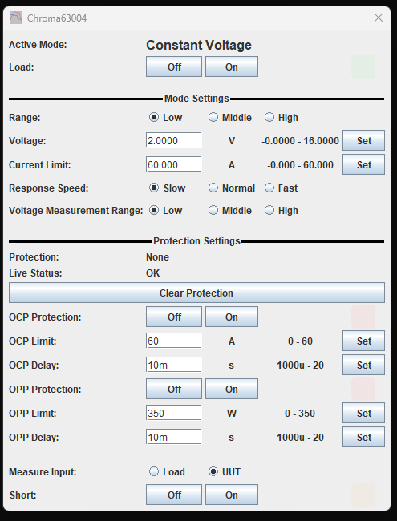
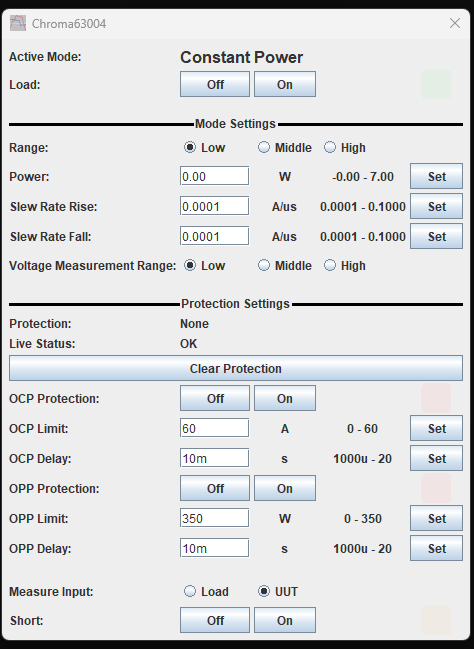
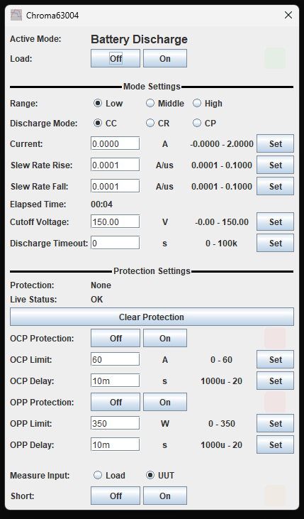
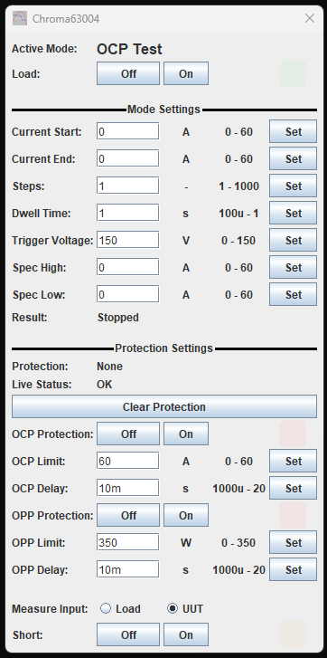
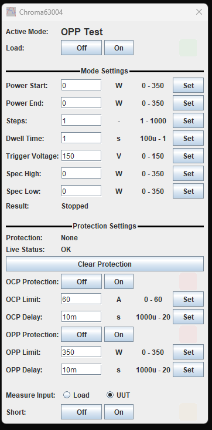

# TC-Drivers

Device drivers for [TestController](https://lygte-info.dk/project/TestControllerIntro%20UK.html),
HKJ's program for logging and controlling bench instruments.

Each driver here has been written against the instrument's programming manual and then
**verified against the physical instrument** — every command exercised, and every
per-range limit read back from the hardware rather than copied from a datasheet.

Discussion and support for TestController itself is on the EEVblog forum thread
[Program that can log/control many multimeters and other devices](https://www.eevblog.com/forum/index.php?topic=234726.0).

---

## Drivers

| Driver | Instruments | Interface | Rev |
| --- | --- | --- | --- |
| [`Chroma_63000_Series.txt`](drivers/Chroma_63000_Series.txt) | Chroma 63003-150-40, 63004-150-60 DC electronic load | GPIB / LXI / serial | 1.0 |

### Chroma 63000 series

Constant current, constant voltage, constant resistance, constant power, battery
discharge, and the OCP and OPP sweep tests. Low, middle and high ranges are offered as a
preset **within** each mode rather than as separate modes, so the mode buttons stay one
per real mode.

Setpoint limits change with the selected range, and the driver carries the correct span
for each one — a 63004 in CR High accepts 64–2500 Ω where CR Low accepts 0.05–250 Ω.
Offering the full model span instead would let you type a value the load silently
ignores.

Also exposed: latched protection status with a clear button, real-time status, OCP/OPP
sweep results, the discharge timer, the voltage sense point, and short-circuit
simulation.

Instrument quirks worth knowing before you use it are collected in
[`docs/chroma-63000-notes.md`](docs/chroma-63000-notes.md).

---

## Installing a driver

Copy the `.txt` file into your TestController `Devices` folder and restart:

| Platform | Location |
| --- | --- |
| Windows | `Documents\TestController\Devices\` |
| Linux / macOS | `~/TestController/Devices/` |

TestController identifies the instrument from its `*IDN?` response, so once the file is
in place the device appears when you scan the interface it is connected to.

If a driver does not appear, check that no other driver in the folder claims the same
`#idString` — only one can win the match.

---

## Screenshots

One button per real mode — the low/middle/high range is a preset inside each mode, not a
mode of its own:

Every mode page follows the same order: the active mode, the Load button, the settings
for that mode, then the global protection settings and short-circuit simulation. The
setpoint limits shown beside each field are those of the **selected range**.

| | |
| --- | --- |
|  |  |
| **Constant current** | **Constant voltage** |
|  |  |
| **Constant resistance** — the slew span follows the current measurement range | **Constant power** |
|  |  |
| **Battery discharge** — elapsed time as `hh:mm:ss` | **OCP test** — sweep parameters and result |

**OPP test.**

---

## Contributing and issues

Please raise problems as GitHub issues. Useful things to include:

- the instrument model and firmware revision (`*IDN?`)
- how it is connected (GPIB gateway, USB-serial, LXI)
- a TestController debug log covering the problem

Bug reports about TestController itself belong on the EEVblog thread above, not here.

---

## License

MIT — see [LICENSE](LICENSE). Attribution to **Cyclotron** is retained in the header of
each driver file; please keep it there if you redistribute or adapt one.

TestController is HKJ's work and is not covered by this license.
