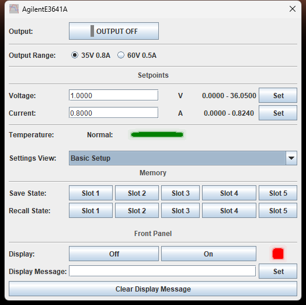
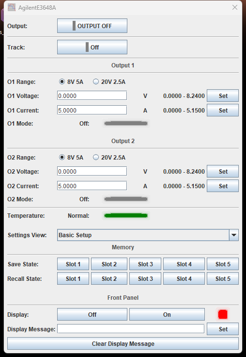
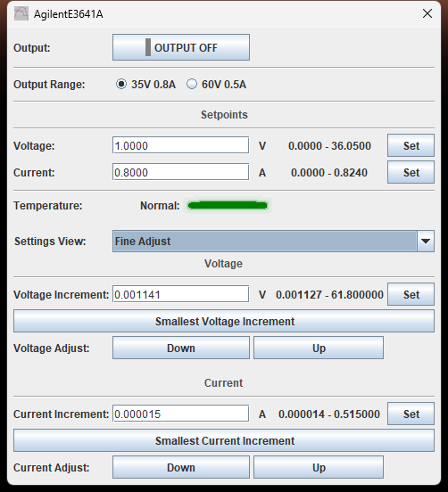
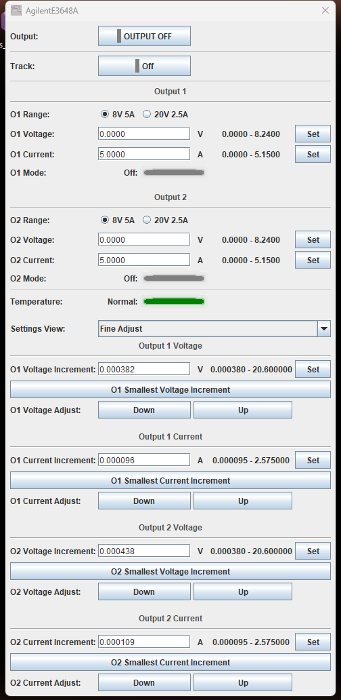
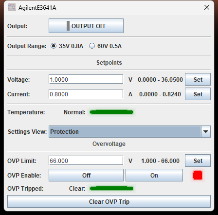
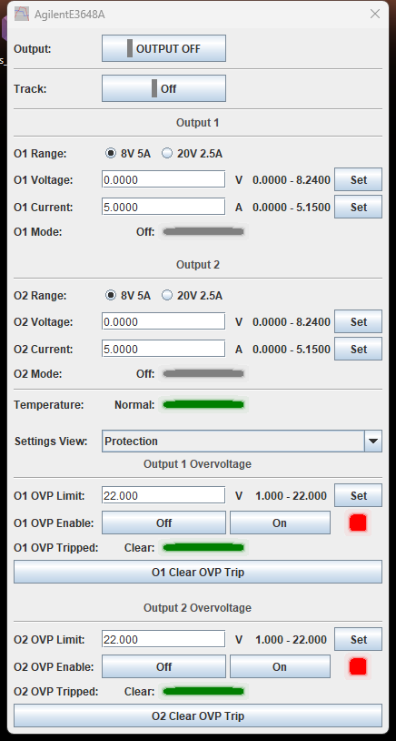
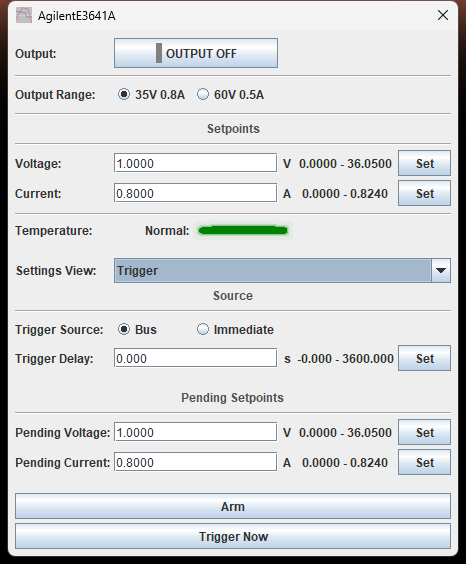
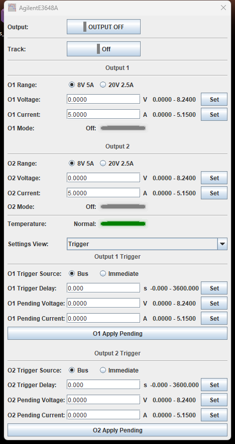
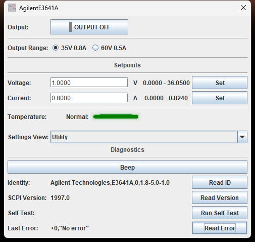
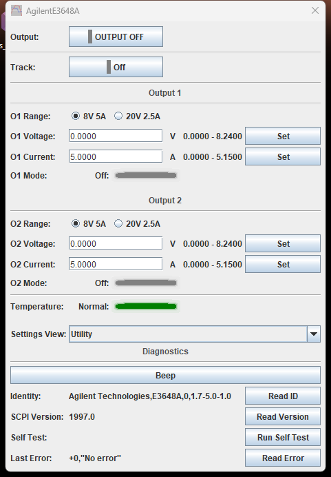

# Agilent / Keysight E364xA Series DC Power Supplies

TestController driver for the whole ten-model **E364x** family: the single-output
**E3640A–E3645A** and the dual-output **E3646A–E3649A**, under Agilent and, from 2014,
Keysight branding. One file covers all ten — a dual-output model gets a second output
and a voltage/range Track toggle that a single-output model simply does not have.

Verified against a live **E3641A** (single-output, firmware 1.8-5.0-1.0) and a live
**E3648A** (dual-output, firmware 1.7-5.0-1.0), both over GPIB and RS-232. Range ceilings
and the finest step were read back from each instrument rather than copied from the data
sheet.

| | |
| --- | --- |
| **Driver** | [`Agilent_Keysight_E364xA_Series.txt`](Agilent_Keysight_E364xA_Series.txt) |
| **Revision** | 1.4 |
| **Interface** | GPIB, RS-232 |
| **Instrument notes** | [`instrument-notes.md`](instrument-notes.md) |

| Model | Low range | High range | Tier | Outputs |
| --- | --- | --- | --- | --- |
| E3640A | 8 V / 3 A | 20 V / 1.5 A | 30 W | 1 |
| E3641A | 35 V / 0.8 A | 60 V / 0.5 A | 30 W | 1 |
| E3642A | 8 V / 5 A | 20 V / 2.5 A | 50 W | 1 |
| E3643A | 35 V / 1.4 A | 60 V / 0.8 A | 50 W | 1 |
| E3644A | 8 V / 8 A | 20 V / 4 A | 80 W | 1 |
| E3645A | 35 V / 2.2 A | 60 V / 1.3 A | 80 W | 1 |
| E3646A | 8 V / 3 A | 20 V / 1.5 A | 60 W | 2 |
| E3647A | 35 V / 0.8 A | 60 V / 0.5 A | 60 W | 2 |
| E3648A | 8 V / 5 A | 20 V / 2.5 A | 100 W | 2 |
| E3649A | 35 V / 1.4 A | 60 V / 0.8 A | 100 W | 2 |

Low/high range figures are per output on the dual-output models. Only the **E3641A** and
**E3648A** figures have been confirmed on hardware. The other eight models are
manual-derived and have not yet been checked against a physical unit — reports welcome.

This replaces the previous single-output-only `HP_Agilent_E364xA.txt`. If you already
have that file installed, replacing it with this one is a drop-in swap for all six of its
models — `#name`, `#idString` and `#handle` are unchanged, so saved setups are unaffected.

---

## The Setup dialog

Everything you touch while a supply is running sits at the top of the dialog and never
moves; a **Settings View** dropdown swaps one of five panels into the space underneath.

**Single-output models** show one Output Range / Voltage / Current group:

**Dual-output models** show the same group twice, Output 1 and Output 2, plus a Track
toggle that links Output 2 to Output 1's voltage and range:

The top strip is the whole working set:

- **Output** is a single button showing the state it is in, the way the instrument's own
  output key does — grey for off, green for on. It is instrument-wide even on dual
  models: there is one Output button, not one per output, because the hardware itself has
  no per-output output-enable command.
- **Track** (dual models only) links Output 2's voltage and range to Output 1's. With it
  on, Output 2's own voltage and range controls are disabled, since writing them directly
  has no effect while tracking is active.
- **Range** picks the low or high range per output. Changing it switches the output(s)
  off first — instrument-wide on dual models, so changing either output's range drops
  both.
- **Voltage** and **Current** are the live setpoints, per output. The supply holds the
  voltage until the load reaches the current limit, then crosses into constant current by
  itself.
- **Temperature** lights red on an overtemperature shutdown, green otherwise.

**The ceilings beside each setpoint follow the selected range.** On the E3641A's 35 V
range they read `0.0000 - 36.0500` and `0.0000 - 0.8240`; switching to the 60 V range
rewrites them to `0.0000 - 61.8000` and `0.0000 - 0.5150`. This matters because on the
low range the supply does **not** enforce its own ceiling — it will accept a value above
the low-range maximum without complaint, up to the high range's ceiling. The high range's
ceiling *is* enforced. See [`instrument-notes.md`](instrument-notes.md).

Changing the Settings View sends nothing to the supply — it is a client-side choice of
which panel to draw, and the dialog opens on Basic Setup.

---

## Basic Setup

The panel the dialog opens on. Two groups that belong to no particular task:

**Memory** — five nonvolatile state slots (`*SAV` / `*RCL` 1–5). A stored state carries
the voltage, current, range, output state, protection, trigger, display and step settings
for the whole instrument (both outputs on a dual model), so recalling one can switch the
output **on**; the driver re-reads the output state and every setpoint after a recall so
the dialog cannot show a stale picture.

**Front Panel** — turn the display off, or write up to 12 characters to it.
**Clear Display Message** blanks the panel *and* the instrument's text buffer; emptying
the buffer takes a second command, and skipping it puts the message straight back on the
next read (the reason is in [`instrument-notes.md`](instrument-notes.md)). This control
is single, one per instrument, on every model including the dual-output ones.

`OUTP:REL` (an optional TTL relay-control signal on the RS-232 connector) is
**deliberately not exposed** — the family's manual warns that using RS-232 while relay
signals are configured can damage the RS-232 circuitry, and this driver supports RS-232.
See [`instrument-notes.md`](instrument-notes.md).

The display is also exposed to TestController itself, so a Step or the Remote Readout
popup can write a label to it without going through this panel.

---

## Fine Adjust

The knob equivalent: set an increment per output, then nudge the live setpoint with
Down/Up. **Smallest Voltage Increment** and **Smallest Current Increment** drop straight
to the instrument's finest resolution for that output — on an E3641A that is 0.001127 V
and 0.0000145 A, which is also the floor each field accepts. Dual models repeat this
group once per output.

The fields are named `_Increment` rather than `_Step` because they set how far one
Down/Up press moves the output, not a value to sweep. The supply refuses a Down/Up that
would leave the selected range.

---

## Protection

Overvoltage only — **the E364xA family has no overcurrent protection command**
(`CURR:PROT` returns an undefined-header error), so there is no OCP threshold, enable or
trip here. The current *limit* at the top of the dialog still regulates: the supply
crosses into constant current and keeps going. Overvoltage protection **trips** — the
output is programmed to zero and fires the crowbar — so set `OVP Limit` above your
working voltage with margin. Dual models repeat this group once per output, with
independent limits and trip state.

`OVP Tripped` reads green **Clear** when nothing has tripped and red **Tripped** when
something has. Both states are lit, so an unlit indicator means the driver has not read
the value yet. Clearing a trip while the condition is still present just trips it again;
lower the setpoint or raise the threshold first.

---

## Trigger

Stage a voltage/current pair and apply it on a trigger, for a timed or synchronised step
rather than an immediate change. On single-output models, **Arm** issues `INIT`; with the
source set to Bus the supply then waits for **Trigger Now**, and with Immediate the
pending values are applied as soon as Arm is pressed. **Trigger Delay** sits between the
trigger and the transfer, and is ignored when the source is Immediate.

On dual models, each output gets one **Apply Pending** button instead of separate Arm and
Trigger Now — arming and firing have to be sent as a single chained message on these
models, or the trigger disarms in between. See
[`instrument-notes.md`](instrument-notes.md).

The pending setpoints follow the active range exactly as the live ones do.

---

## Utility

The beeper — useful for working out which supply on the bench you are talking to — and
the on-demand diagnostics: identity, SCPI version, self-test, and the oldest error queue
entry. These are buttons rather than continuous readouts because each query consumes what
it reads: popping the error queue removes the entry. This page is identical on single-
and dual-output models, since diagnostics are instrument-wide, not per-output.

A query this family rejects reports its error one command **late** (a rejected query
leaves a pending response), so an error that Read Error appears to blame on a healthy
command is usually a stale entry from the command before it. See
[`instrument-notes.md`](instrument-notes.md).

---

## Logged channels

Logging scope is chosen from the **mode menu**, not from the dialog:

- **Log All** — `Voltage`, `Current` (`MEAS:VOLT?` / `MEAS:CURR?`), `VoltageSet`,
  `CurrentSet` (`VOLT?` / `CURR?`), and a regulation channel — five channels on
  single-output models, ten (duplicated per output) on dual-output models.
- **Log V and I only** — `Voltage` and `Current`, per output — for when several
  instruments share one logging interval and the full cycle no longer fits.

The regulation channel catches the moment a load pulls a supply out of constant voltage
into constant current — invisible from voltage and current alone when the limit sits
where the load settles. It is logged as a **digital** channel, so the column reads `CC`
or `CV` instead of a number and the chart draws it on the shared digital scale. An output
that is off or unregulated leaves the column blank; a saved log file keeps the raw
integer either way. Details in [`instrument-notes.md`](instrument-notes.md).

Because the logging scope is a mode rather than a checkbox, TestController locks it while
a log is running, so a log's columns cannot change partway through.

---

## Installing

Copy [`Agilent_Keysight_E364xA_Series.txt`](Agilent_Keysight_E364xA_Series.txt) into your
TestController `Devices` folder and restart. If you have the earlier
`HP_Agilent_E364xA.txt` installed, remove it first — both files declare the same
`#idString` for the six single-output models and cannot coexist in the same `Devices`
folder. TestController ships no driver for this family, so there is no stock file to
move aside.
