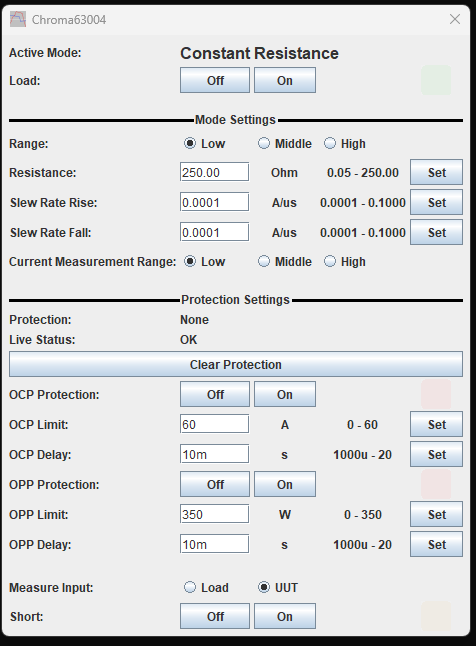
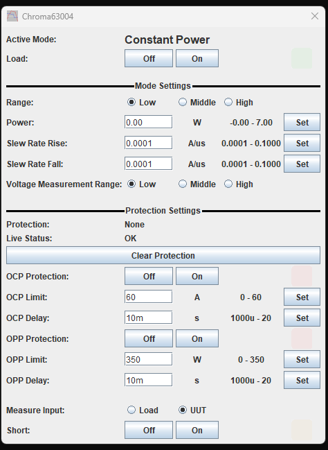
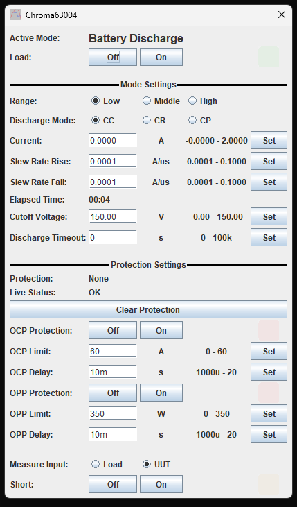
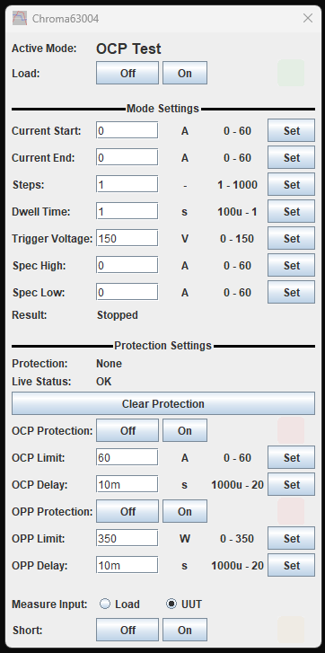
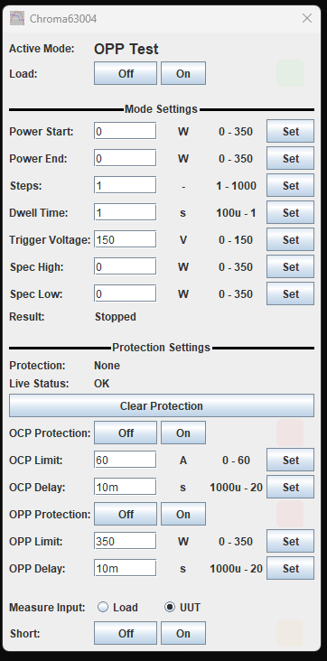

# Chroma 63000 Series DC Electronic Load

TestController driver for the **Chroma 63003-150-40** and **63004-150-60**.

Verified against a 63004-150-60 (firmware 2.01) over GPIB — every command exercised on
the instrument, and every per-range setpoint limit read back from the hardware rather
than copied from the datasheet.

| | |
| --- | --- |
| **Driver** | [`Chroma_63000_Series.txt`](Chroma_63000_Series.txt) |
| **Revision** | 1.0 |
| **Interface** | GPIB, LXI, serial |
| **Instrument notes** | [`instrument-notes.md`](instrument-notes.md) |

---

## Modes

One button per real mode. Low, middle and high are a **preset within** each mode rather
than modes of their own, so the popup stays short and the range is picked on the page
itself.

Every mode page follows the same order — the active mode, the Load button, that mode's
settings, then the shared protection block and short-circuit simulation at the bottom.

---

## Constant current and constant voltage

The setpoint limits beside each field are those of the **selected range**, not the
model's full span. Picking a different range rewrites them.

`Turn On Voltage` is Von — the input voltage the load waits for before it starts
drawing. Set above your supply, it makes the load look like it is refusing to switch on.

---

## Constant resistance and constant power

In constant resistance the slew rate is a **current** slew, so its span follows
`Current Measurement Range` rather than the resistance range. Change that radio and the
slew limits change with it.

---

## Battery discharge

The discharge value is labelled and ranged for the selected discharge mode — amps in CC,
ohms in CR, watts in CP. `Elapsed Time` is the load's own timer, shown as `hh:mm:ss`.

**`Discharge Timeout` of 0 does not mean "no limit".** It is a zero-second timeout: the
discharge stops after about 100 µs and the load looks like it is refusing to switch on,
with no error reported. Set a real duration.

The timer cannot be zeroed on demand — the FETCH subsystem is query-only. The load
restarts the count at the start of each discharge, so switching Load off and on is the
reset.

---

## OCP and OPP sweep tests

`Steps` is a step **count** (1–1000), not an increment. `Result` decodes the sweep state
— `Stopped`, `Ready`, `Running` — or shows pass/fail with the measured value once a
sweep has produced one.

These modes are refused while short-circuit simulation is on. If a sweep mode button
appears to do nothing, check `Short` first.

---

## Protection

Shown at the bottom of every mode page, because these are instrument-wide settings
rather than per-mode ones.

- **Protection** — latched. Says what tripped the load, and stays set until
  `Clear Protection`.
- **Live Status** — real time. Says whether the fault is still present, and clears
  itself when it is.

A forced over-current trip returns code 32. The manual's bit table predicts 8 for the
same event, so only code 32 is named; anything else is shown as a raw number rather than
risk labelling a trip wrongly. See [`instrument-notes.md`](instrument-notes.md).

---

## Installing

Copy [`Chroma_63000_Series.txt`](Chroma_63000_Series.txt) into your TestController
`Devices` folder and restart. The instrument is identified from its `*IDN?` response, so
it appears when you scan the interface it is connected to.
