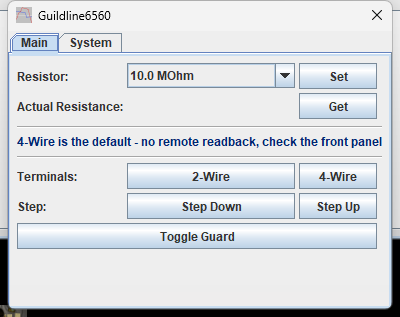
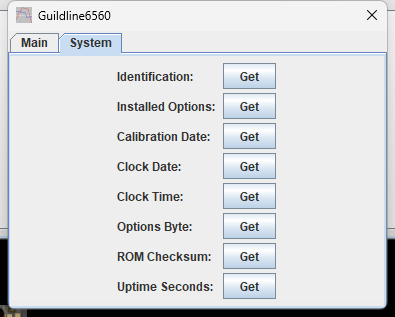

# Guildline Instruments 6560 Precision Resistance Calibrator

TestController driver for the **Guildline Instruments 6560**, a decade resistance
standard covering 0 Ω to 100 MΩ across 19 nominal values plus Open Circuit.

Verified against a 6560 (firmware rev D) over a Prologix GPIB-Ethernet gateway — every
command exercised live, including a measured relay-settle timing sweep used to size the
driver's read timeout and update delay.

| | |
| --- | --- |
| **Driver** | [`Guildline_6560.txt`](Guildline_6560.txt) |
| **Revision** | 1.2 |
| **Interface** | GPIB |
| **Instrument notes** | [`instrument-notes.md`](instrument-notes.md) |

---

## Main page

`Resistor` selects one of the 19 nominal standards or Open Circuit; `Set` writes it.
`Actual Resistance` reads back the instrument's calibrated value for whatever is
currently selected — it will differ slightly from the nominal figure, since that is the
whole point of a calibration standard.

`Terminals` switches between 2-wire and 4-wire measurement. **The instrument has no
remote query for which one is currently active** — if in doubt, check the 2-TERMINAL /
4-TERMINAL LED on the front panel. 4-wire is the default after a Device Clear, which is
called out directly above the control since there is no other way to see it in TestController.

`Step Down` / `Step Up` move to the adjacent standard in the 19-value sequence.
`Toggle Guard` switches the guard relay connection.

## System page

Read-only instrument information: identification, installed options, calibration date,
internal clock, the option-switch byte, ROM checksum, and uptime since power-on. Each
field is fetched on demand with its own `Get` button.

---

## Installing

Copy [`Guildline_6560.txt`](Guildline_6560.txt) into your TestController `Devices`
folder and restart. The instrument is identified from its `*IDN?` response, so it
appears when you scan the GPIB interface it is connected to.
