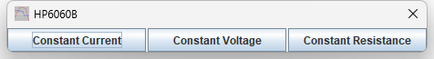
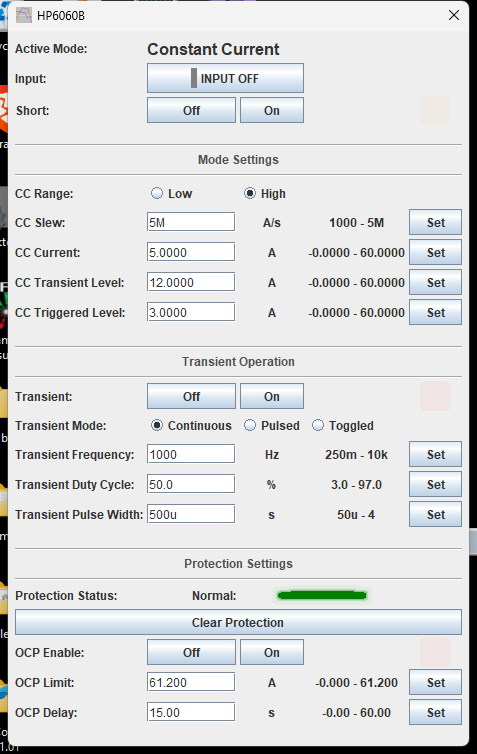
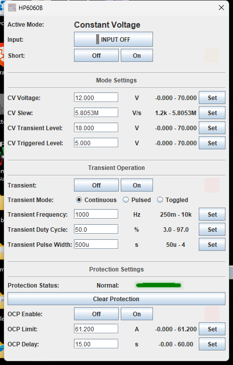
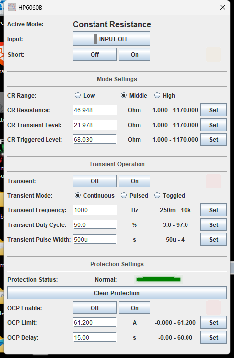

# HP / Agilent 6060B DC Electronic Load

TestController driver for the **HP / Agilent 6060B**, the 300 W / 60 V / 60 A
single-input electronic load.

Verified against a 6060B (firmware `A.02.01`) over GPIB — every command exercised on the
instrument, and every per-range setpoint limit read back from the hardware rather than
copied from the datasheet.

| | |
| --- | --- |
| **Driver** | [`HP_Agilent_6060B.txt`](HP_Agilent_6060B.txt) |
| **Revision** | 1.1 |
| **Interface** | GPIB / LXI / serial |
| **Instrument notes** | [`instrument-notes.md`](instrument-notes.md) |

---

## Modes

One button per mode — **Constant Current**, **Constant Voltage**, **Constant
Resistance**. The Setup dialog shows one mode at a time: the active mode and the Input
control on top, that mode's settings in the middle, and the transient and protection
settings — which apply whatever the mode — at the bottom.

`Input` is a single button that carries its own state, grey when off and green when on,
the way the load's front-panel Input key works. `Short` simulates a short across the
input; `INPUT OFF` overrides it.

---

## Constant current

Two ranges. `Range` writes the range through `CURR:RANG` — Low is 0–6 A, High is
0–60 A — and the Current, Transient Level and Triggered Level fields re-scale to match.
`Slew` is in **amps per second**; the load snaps it to one of twelve fixed steps, so
the value you read back is usually not the one you typed.

`Transient Level` is the upper level used while transient operation is on; `Triggered
Level` becomes the main level when a GPIB trigger arrives.

---

## Constant voltage

One range. The operating span is 3–60 V; the load accepts a setpoint up to 70 V. `Slew`
is in **volts per second** and snaps to fixed steps the same way the current slew does —
values outside the range are clamped with no error.

---

## Constant resistance

Three ranges, `Low` / `Middle` / `High`, written through `RES:RANG`. Each has its own
span — roughly 0–1.17 Ω, 1.17–1170 Ω and 11.7–11700 Ω — and the Resistance, Transient
Level and Triggered Level fields re-scale when you change range. Changing range also
moves the present settings to fit the new one.

There is no CR slew field, because the load has no CR slew command: in the low range it
uses the **CV** slew rate, in the middle and high ranges the **CC** slew rate. Set it on
the corresponding mode's Slew field.

In the middle and high ranges the setpoint quantises more coarsely as it rises, so a
large value reads back rounded to the nearest step the load can produce.

---

## Transient operation

Shown on every mode page. `Transient` switches it on and off; the load then alternates
between the mode's main and transient levels at that mode's slew rate.

`Transient Mode` is **Continuous** (a repeating pulse train set by `Frequency` and `Duty
Cycle`), **Pulsed** (one pulse of `Pulse Width` per trigger) or **Toggled** (flip on
each trigger). Only continuous can be set at the front panel.

---

## Protection

Shown at the bottom of every mode page.

- **Protection Status** — green when the questionable-status register reads zero, red on
  any fault. The per-bit decode is not established for this instrument, so a fault shows
  the raw code rather than a named condition; see [`instrument-notes.md`](instrument-notes.md).
- **Clear Protection** clears a latched shutdown (`INPut:PROTection:CLEar`). The input
  stays off until this is pressed and then switched back on.
- **OCP Limit** / **OCP Delay** / **OCP Enable** are the software over-current limit:
  when enabled, input current above the limit for longer than the delay shuts the input
  off, in any mode.

---

## Installing

Copy [`HP_Agilent_6060B.txt`](HP_Agilent_6060B.txt) into your TestController `Devices`
folder and restart. The instrument is identified from its `*IDN?` response, so it
appears when you scan the interface it is connected to.

A companion flat layout — every group on one panel instead of one mode at a time — is
kept in the development repository as `HP_Agilent_6060B_flat.txt`. It carries the same
command set and limits; this repository ships the per-mode layout.
