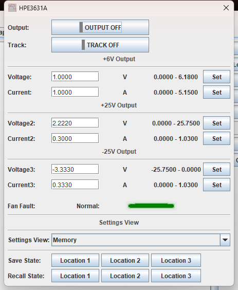
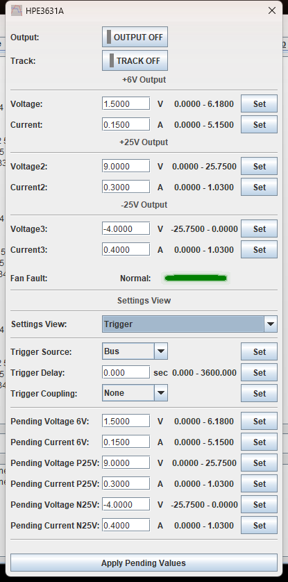
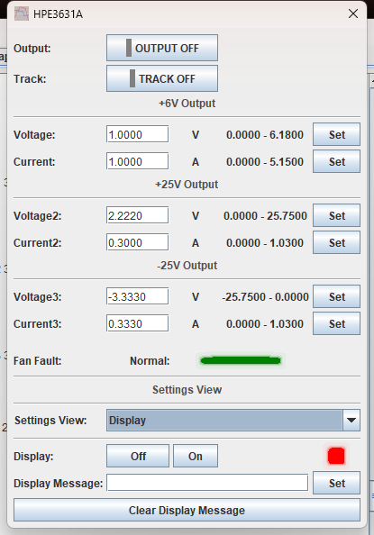
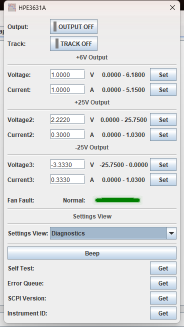
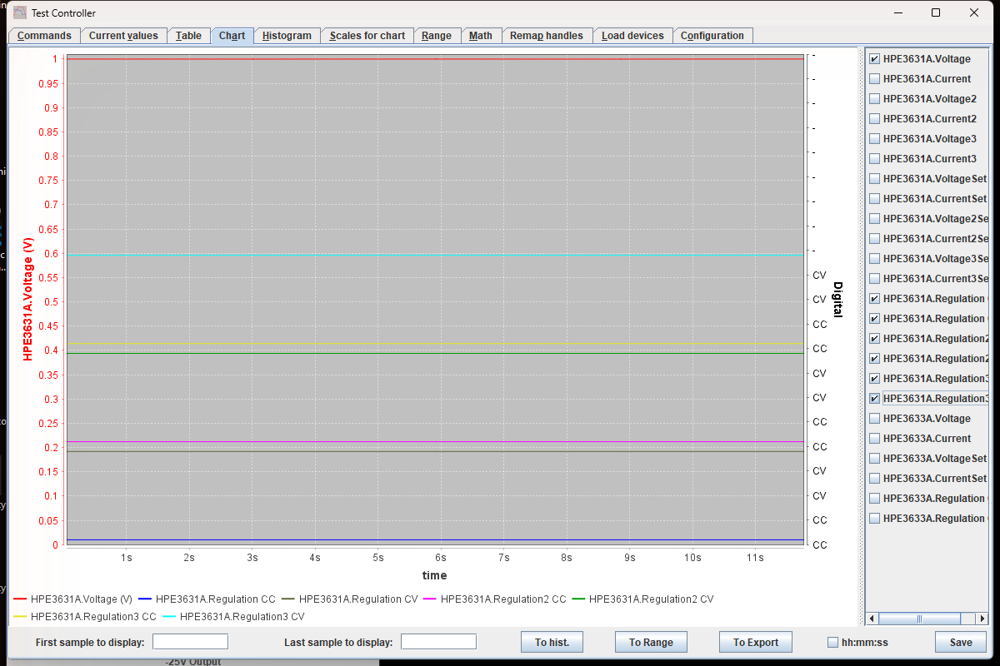

# HP / Agilent / Keysight E3631A Triple-Output DC Power Supply

TestController driver for the **E3631A**, the triple-output bench supply with a +6 V,
a +25 V and a -25 V output.

Verified against an E3631A (firmware 2.1-5.0-1.0) over GPIB — every command exercised on
the instrument, and every setpoint ceiling read back from the hardware with `VOLT? MAX`
and `CURR? MAX` rather than copied from the data sheet.

| | |
| --- | --- |
| **Driver** | [`HP_Agilent_E3631A.txt`](HP_Agilent_E3631A.txt) |
| **Revision** | 1.2 |
| **Interface** | GPIB, RS-232 |
| **Instrument notes** | [`instrument-notes.md`](instrument-notes.md) |

| Output | Voltage | Current |
| --- | --- | --- |
| +6 V | 0 – 6.18 V | 0 – 5.15 A |
| +25 V | 0 – 25.75 V | 0 – 1.03 A |
| -25 V | -25.75 – 0 V | 0 – 1.03 A |

There is **no programmable OVP or OCP on this model** — the instrument has none, so
nothing is missing from the driver's protection side. The current fields are limits that
*regulate*: the supply crosses into constant current and keeps going.

---

## Read this before automating the supply

Three behaviours will cost you a test run, and all three are **silent** — the instrument
queues no error, and TestController shows nothing. Each is repeated in the tip of the
control it affects, but tips are easy to miss.

### The automated tools do not switch the output on

TestController's automated output control skips the output for any driver that declares
more than one channel, and reports nothing when it does. This driver declares three, one
per output.

So an **Auto Adjust** or **Param Sweeper** run will step the setpoints, log a full set of
samples, and leave `OUTP?` reading `0` the whole way through — a sweep into a dead output
that looks exactly like a sweep that worked. **Switch `Output` on yourself before starting
one.**

The three-channel declaration is deliberate and is what puts all three outputs in the
panel and in the Steps popup, so the driver carries the cost rather than surrendering
that.

### Arm and fire are one control, because a channel re-select disarms the trigger

Selecting a channel between `INIT` and `*TRG` disarms an armed trigger, and the error
queue stays clean afterwards. This driver issues a channel select on every logging cycle,
so the window is real rather than theoretical, and how often you lose the trigger depends
on the logging cadence: at a 3 s logging interval the armed trigger survived **9 of 9**
attempts; at 0.3 s it was lost **2 of 2**, with the logging-stopped control leg firing
normally both times.

`Apply Pending Values` therefore chains `INIT` and `*TRG` into a single message, which
nothing can interleave with. The cost is that **arm-now-fire-later is not offered from
this page** — which is the point of a bus trigger. To do that, stop logging and drive
`INIT` and `*TRG` from a script.

### Recall does not restore the trigger delay faithfully

`*RCL` brings `TRIG:DEL` back changed, contrary to the manual. Two runs on the bench, the
first confirmed on the wire with `TRIG:DEL?`:

| Stored | Changed to before the recall | After `*RCL` |
| --- | --- | --- |
| 2.500 s | 1.000 s | **2.000 s** |
| 3.750 s | 0.250 s | **3.000 s** |

Isolated with `TRIG:SOUR` held constant; every other recalled setting — setpoints, output
state, tracking, trigger source — restores correctly, so it is the delay specifically and
not a general failure of the trigger subsystem to restore.

Both measurements are consistent with the fractional part being dropped, but that is an
inference from two points and has not been tested below 1 s. Treat the delay as unreliable
across a recall and re-enter it by hand: nothing warns you, and a stored delay silently
losing its fraction turns a calibrated step into a different one.

---

## Main panel

Always visible, whichever settings panel is selected: the output enable, tracking, the
three voltage/current pairs, and the fan-fault indicator.

**`Output` is global.** The E3631A has one output enable for all three outputs and no
per-output control, so this one button switches +6 V, +25 V and -25 V together.

**`Track`** slaves the -25 V output to the +25 V one. Turn it **off** before setting
`Trigger Coupling` to `All` — tracking and coupling are mutually exclusive, and the supply
rejects the coupling with error 800 if you do not.

**`Fan Fault`** reads bit 4 of `STAT:QUES:COND?`. On this model that bit is the **fan**,
not the overtemperature bit it is on the E363xA. The status-register map of the two
families is not the same one; see [`instrument-notes.md`](instrument-notes.md) before
carrying anything across.

Below the indicator, the **`Settings View`** selector chooses which of the four settings
panels is shown underneath: Trigger, Memory, Display or Diagnostics. The screenshot above
has **Memory** selected.

---

## Trigger

Stage a voltage and current for each of the three outputs, then transfer all six to the
live outputs at once.

- **`Trigger Source`** — `Bus` waits for the trigger, `Immediate` fires on the arm.
- **`Trigger Delay`** — 0 to 3600 s between the trigger and the output change.
- **`Trigger Coupling`** — `All` couples the outputs so one trigger updates them together.
  Requires `Track` off.
- **`Pending Voltage`/`Pending Current`** for each output — the staged values, with the
  same ceilings as the live setpoints.
- **`Apply Pending Values`** — arms and fires as one chained message, and refreshes the
  six live setpoint fields afterwards.

With `Trigger Source` set to `Immediate`, the transfer happens on the arm and the trailing
`*TRG` has nothing left to fire; check the error queue on the Diagnostics panel if you use
that combination.

---

## Memory

Three save locations and three recall buttons, shown at the bottom of the
[main-panel screenshot](screenshots/e3631a-main.png) above.

`Save State` writes the instrument state to non-volatile memory; `Recall State` brings it
back and refreshes the setpoints, output, tracking and trigger source. `Trigger Delay` is
the one thing that does **not** come back intact — see above.

---

## Display

The front-panel display: on/off with a state lamp, a message field, and a clear button.

**The message field silently truncates.** The supply shows at most **12 characters** and
drops the rest without queueing an error; only a string longer than 40 characters is
rejected (`-223`). The `12` beside the field is a display width, not an input cap, so
TestController will happily accept a longer string and show you no sign that it was cut.

**A double quote in the message breaks it.** The text is sent as `DISP:TEXT "<value>"`, so
`AB"CD` arrives as three quotes and the supply answers `-103,"Invalid separator"` and
keeps the previous text. The field snaps back and nothing else is reported. Avoid `"` in
display strings. The same applies to strings written from a step or from the Remote
Readout popup, which take the same path.

**`Clear Display Message` clears the panel but not the buffer.** `DISP:TEXT:CLE` returns
the instrument to its normal readout, but a following `DISP:TEXT?` still returns the old
string, so the field repopulates with the text you just cleared. The panel is clear; the
field is lying.

---

## Diagnostics

A beeper — useful for working out which supply on the bench you are talking to — and four
on-demand queries: self test, error queue, SCPI version and instrument ID.

These are buttons rather than continuous readouts because each query consumes what it
reads: popping the error queue removes the entry. `Self Test` takes about 1.2 s against
the driver's 2 s read timeout, so it fits, but the margin is not large.

---

## Logged channels

Logging scope is chosen from the **mode menu**:

- **Log All** — fifteen channels (default)
- **Log V and I only** — the six measured channels

| Channel | Source | Meaning |
| --- | --- | --- |
| `Voltage`, `Current` | `MEAS:VOLT? P6V`, `MEAS:CURR? P6V` | what the +6 V terminals are doing |
| `Voltage2`, `Current2` | `MEAS:VOLT? P25V`, `MEAS:CURR? P25V` | the +25 V output |
| `Voltage3`, `Current3` | `MEAS:VOLT? N25V`, `MEAS:CURR? N25V` | the -25 V output |
| `VoltageSet` … `Current3Set` | `VOLT?`, `CURR?` per output | what the supply was asked for |
| `Regulation`, `Regulation2`, `Regulation3` | `STAT:QUES:INST:ISUM<n>:COND?` | which side each output is regulating on |

Charting a measurement against its setpoint shows the output sagging away from the demand
under load. The `Regulation` channels catch the moment a load pulls an output out of
constant voltage into constant current — usually the point of the test, and invisible from
voltage and current alone when the limit sits where the load settles.

**Log V and I only** trims the cycle to the six measured channels for when several
instruments share one logging interval and the full fifteen-channel cycle no longer fits.
Because it is a mode rather than a checkbox, TestController locks it while a log is
running, so a log's columns cannot change partway through.

### The three regulation channels cost no chart space

The regulation channels are digital values, not numbers. Each one splits into a chart
channel per named bit — `Regulation CC`, `Regulation CV`, and the same for outputs 2 and
3 — and all six draw on a single shared right-hand **Digital** axis. Only one numeric axis
is consumed, by `Voltage` on the left. Three regulation channels therefore cost **zero**
numeric curves rather than three.

A register reading 0 renders **blank** on screen rather than `0`. That is the digital
formatting working; the saved log file still records the raw integer, so nothing is lost
from the data. A literal `0` in the column means the digital formatting is not live — most
likely an older copy of the driver is still in your `Devices` folder.

---

## Installing

Copy [`HP_Agilent_E3631A.txt`](HP_Agilent_E3631A.txt) into your TestController `Devices`
folder and restart.

If the supply does not appear, check that no other driver in the folder claims the same
`#idString` — only one can win the match.
