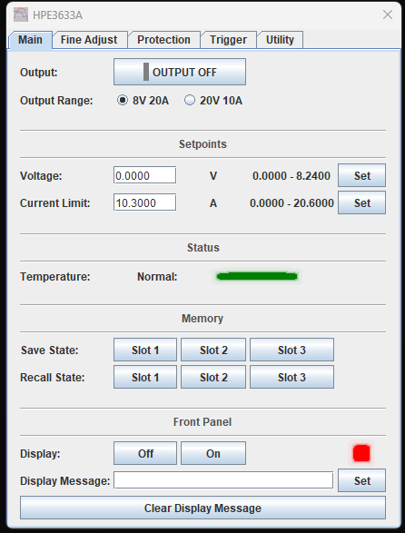
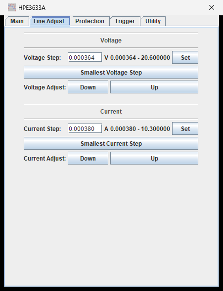
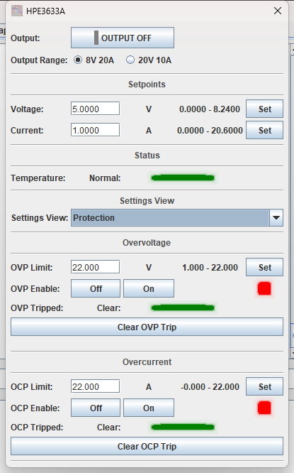
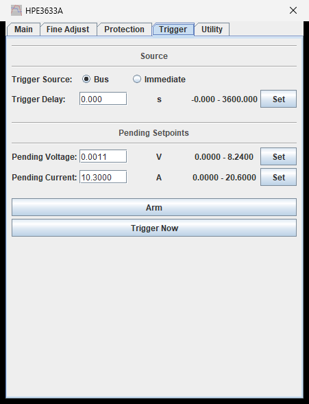
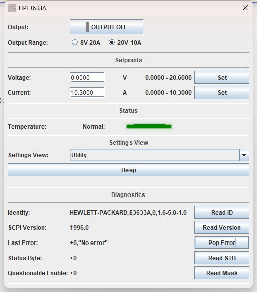
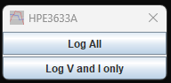

# HP / Agilent / Keysight E363xA DC Power Supplies

TestController driver for the **E3632A**, **E3633A** and **E3634A** single-output,
dual-range bench supplies.

Verified against an E3633A (firmware 1.6-5.0-1.0) over GPIB — every command exercised on
the instrument, and every range ceiling read back from the hardware rather than copied
from the data sheet.

| | |
| --- | --- |
| **Driver** | [`HP_Agilent_E363xA.txt`](HP_Agilent_E363xA.txt) |
| **Revision** | 1.4 |
| **Interface** | GPIB, RS-232 |
| **Instrument notes** | [`instrument-notes.md`](instrument-notes.md) |

| Model | Low range | High range |
| --- | --- | --- |
| E3632A | 15 V / 7 A | 30 V / 4 A |
| E3633A | 8 V / 20 A | 20 V / 10 A |
| E3634A | 25 V / 7 A | 50 V / 4 A |

The E3632A and E3634A figures are manual-derived and have not yet been confirmed on
hardware. Reports welcome.

---

## Main

Output, range, and the two setpoints — that is the whole working set, so it stays on one
tab while the supply is running.

**The ceilings beside each field follow the selected range.** Switching to 20V 10A
rewrites them to `0 - 20.6000` and `0 - 10.3000`. This matters more than it looks: the
supply does **not** enforce its own range, and will accept 15 V in the 8 V range without
complaint. See [`instrument-notes.md`](instrument-notes.md).

`Regulation` is not shown here because it is a logged channel — see below.

Temperature, the three stored states and the front-panel display controls sit beneath
the setpoints, since none of them belong behind a tab you have to go looking for.

---

## Fine Adjust

The knob equivalent: set a step, then nudge the live setpoint with Down/Up. **Smallest
Step** sets the instrument's finest resolution — 0.0003644 V and 0.0003802 A on the
E3633A.

---

## Protection

Overvoltage and overcurrent, each with a threshold, an enable, a trip indicator and a
clear button.

`OVP Limit` is not the same thing as `Current Limit` on the Main tab. The current limit
**regulates** — the supply crosses into constant current and keeps going. Overcurrent
protection **trips** — the output is programmed to zero and stays there until cleared.

---

## Trigger

Stage a voltage/current pair and apply it on a trigger, for a timed or synchronised step
rather than an immediate change. **Arm** issues `INIT`; with the source set to Bus the
supply then waits for **Trigger Now**, and with Immediate the pending values are applied
as soon as Arm is pressed.

The pending setpoints follow the active range, exactly as the live ones do.

---

## Utility

The beeper — useful for working out which supply on the bench you are talking to — and
the on-demand diagnostics. These are buttons rather than readouts because each query
consumes what it reads: popping the error queue removes the entry.

---

## Logged channels

Logging scope is chosen from the **mode menu**:

- **Log All** — five channels (default)
- **Log V and I only** — Voltage and Current

| Channel | Source | Why |
| --- | --- | --- |
| `Voltage`, `Current` | `MEAS:VOLT?`, `MEAS:CURR?` | what the terminals are doing |
| `VoltageSet`, `CurrentSet` | `VOLT?`, `CURR?` | what the supply was asked for |
| `Regulation` | `STAT:QUES:COND?` | which side it is regulating on |

Charting a measurement against its setpoint shows the output sagging away from the demand
under load. `Regulation` catches the moment a load pulls the supply out of constant
voltage into constant current — usually the point of the test, and invisible from voltage
and current alone when the limit sits where the load settles.

**Log V and I only** trims the cycle to the two measured channels for when several
instruments share one logging interval and the full five-channel cycle no longer fits.
Because it is a mode, not a checkbox, TestController locks it while a log is running, so a
log's columns cannot change partway through. See
[`instrument-notes.md`](instrument-notes.md).

---

## Installing

Copy [`HP_Agilent_E363xA.txt`](HP_Agilent_E363xA.txt) into your TestController `Devices`
folder and restart.

**This driver claims the same `#idString` values as the shipped `AgilentHP E363xA.TXT`.**
Only one can win the match, so move the stock file out of the folder to use this one.
