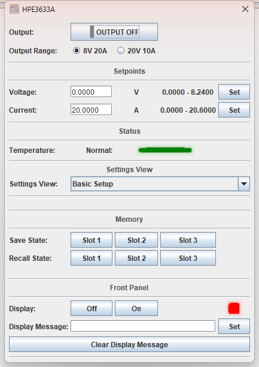
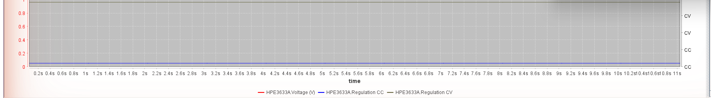

# HP / Agilent / Keysight E363xA DC Power Supplies

TestController driver for the **E3632A**, **E3633A** and **E3634A** single-output,
dual-range bench supplies.

Verified against an E3633A (firmware 1.6-5.0-1.0) over GPIB — every command exercised on
the instrument, and every range ceiling read back from the hardware rather than copied
from the data sheet.

| | |
| --- | --- |
| **Driver** | [`HP_Agilent_E363xA.txt`](HP_Agilent_E363xA.txt) |
| **Revision** | 1.8 |
| **Interface** | GPIB, RS-232 |
| **Instrument notes** | [`instrument-notes.md`](instrument-notes.md) |

| Model | Low range | High range |
| --- | --- | --- |
| E3632A | 15 V / 7 A | 30 V / 4 A |
| E3633A | 8 V / 20 A | 20 V / 10 A |
| E3634A | 25 V / 7 A | 50 V / 4 A |

The E3632A and E3634A figures are manual-derived and have not yet been confirmed on
hardware. Reports welcome.

---

## The Setup dialog

Everything you touch while the supply is actually running — the output, the range and the
two setpoints — sits at the top of the dialog and never moves. Below it, a **Settings
View** dropdown swaps one of five panels into the space underneath.

The top strip is the whole working set:

- **Output** is a single button showing the state it is in, the way the instrument's own
  output key does — grey for off, green for on. One click toggles it.
- **Output Range** picks the low or high range. Changing it switches the output off
  first, so a low-range high-current setup is never carried into high-range voltage.
- **Voltage** and **Current** are the live setpoints. The supply holds the voltage until
  the load reaches the current limit, then crosses into constant current by itself.
- **Temperature** lights red on an overtemperature shutdown.

**The ceilings beside each setpoint follow the selected range.** Above, on the 8 V 20 A
range, they read `0.0000 - 8.2400` and `0.0000 - 20.6000`; switching to 20 V 10 A rewrites
them to `0.0000 - 20.6000` and `0.0000 - 10.3000`. This matters more than it looks: the
supply does **not** enforce its own range, and will accept 15 V in the 8 V range without
complaint. See [`instrument-notes.md`](instrument-notes.md).

Changing the Settings View sends nothing to the supply — it is a client-side choice of
which panel to draw, and the dialog opens on Basic Setup.

> Coming from revision 1.5 or the 1.4 posted to the forum? Those used tabs, and control
> names carried a page qualifier. One control was renamed in the move: `Current_Limit` is
> now `Current`. `#name` and `#handle` are unchanged, so saved setups still match — only
> a script that referred to the old field name needs editing.

---

## Basic Setup

The panel the dialog opens on, and the one in the screenshot above. Two groups that
belong to no particular task:

**Memory** — three nonvolatile state slots. A stored state carries the voltage, current,
range, output state, protection, trigger, display and step settings, so recalling one can
switch the output **on**; the driver re-reads the output state and both setpoints after a
recall so the dialog cannot show a stale picture.

**Front Panel** — turn the display off, or write up to 12 characters to it. **Clear
Display Message** blanks the panel *and* the instrument's text buffer. Emptying the buffer
takes a second command, and skipping it puts the message straight back in the field on the
next read — the reason is in [`instrument-notes.md`](instrument-notes.md).

The display is also exposed to TestController itself, so a Step or the Remote Readout
popup can write a label to it without going through this panel.

---

## Fine Adjust

The knob equivalent: set an increment, then nudge the live setpoint with Down/Up.
**Smallest Voltage Increment** and **Smallest Current Increment** drop straight to the
instrument's finest resolution. On an E3633A that is 0.0003644 V and 0.0003802 A, shown
to the six decimals the fields carry and also the floor each field will accept.

The fields are named `_Increment` rather than `_Step` because they set how far one
Down/Up press moves the output, not a value to sweep — and TestController's Steps popup
lists every adjustable field by name, where "..._Step" reads like something meant for a
Steps program.

The supply refuses a Down/Up that would leave the selected range, so the buttons cannot
walk a setpoint out of it.

---

## Protection

Overvoltage and overcurrent, each with a threshold, an enable, a trip indicator and a
clear button. Both indicators read green **Clear** when nothing has tripped and red
**Tripped** when something has. Both states are lit, so an unlit indicator means the
driver has not read that value yet — it is not a third, quieter way of saying "fine".

`OCP Limit` is not the same thing as the `Current` setpoint at the top of the dialog. The
current limit **regulates** — the supply crosses into constant current and keeps going.
Overcurrent protection **trips** — the output is programmed to zero and stays there until
cleared. Overvoltage protection trips *and* fires the crowbar, so set `OVP Limit` above
your working voltage with margin.

Clearing a trip while the condition that caused it is still present just trips it again;
lower the setpoint or raise the threshold first.

---

## Trigger

Stage a voltage/current pair and apply it on a trigger, for a timed or synchronised step
rather than an immediate change. **Arm** issues `INIT`; with the source set to Bus the
supply then waits for **Trigger Now**, and with Immediate the pending values are applied
as soon as Arm is pressed. **Trigger Delay** sits between the trigger and the transfer,
and is ignored when the source is Immediate.

The pending setpoints follow the active range exactly as the live ones do — the capture
above is on the 20 V 10 A range, and all four ceilings have moved together.

---

## Utility

The beeper — useful for working out which supply on the bench you are talking to — and
the on-demand diagnostics: identity, SCPI version, the oldest error queue entry, the
status byte and the questionable-status enable mask.

These are buttons rather than continuous readouts because each query consumes what it
reads: popping the error queue removes the entry. A query this family rejects reports its
error one command late, so an error that **Pop Error** appears to blame on a healthy
command is usually a stale entry from the command before it. See
[`instrument-notes.md`](instrument-notes.md).

---

## Logged channels

Logging scope is chosen from the **mode menu**, not from the dialog:

- **Log All** — five channels (default)
- **Log V and I only** — Voltage and Current

| Channel | Source | Why |
| --- | --- | --- |
| `Voltage`, `Current` | `MEAS:VOLT?`, `MEAS:CURR?` | what the terminals are doing |
| `VoltageSet`, `CurrentSet` | `VOLT?`, `CURR?` | what the supply was asked for |
| `Regulation` | `STAT:QUES:COND?` | which side it is regulating on |

Charting a measurement against its setpoint shows the output sagging away from the demand
under load. `Regulation` catches the moment a load pulls the supply out of constant
voltage into constant current — usually the point of the test, and invisible from voltage
and current alone when the limit sits where the load settles.

`Regulation` is logged as a **digital** channel rather than a number, so the column names
the mode — `CC` or `CV` — and the chart draws it on the shared digital scale beside the
numeric curves instead of consuming one:

An output that is off or unregulated leaves the column blank rather than showing `0`. A
saved log file keeps the raw integer either way, so nothing is lost to the display format.

**Log V and I only** trims the cycle to the two measured channels for when several
instruments share one logging interval and the full five-channel cycle no longer fits.
Because it is a mode, not a checkbox, TestController locks it while a log is running, so a
log's columns cannot change partway through. See
[`instrument-notes.md`](instrument-notes.md).

---

## Installing

Copy [`HP_Agilent_E363xA.txt`](HP_Agilent_E363xA.txt) into your TestController `Devices`
folder and restart.

**This driver claims the same `#idString` values as the shipped `AgilentHP E363xA.TXT`.**
Only one can win the match, so move the stock file out of the folder to use this one.
