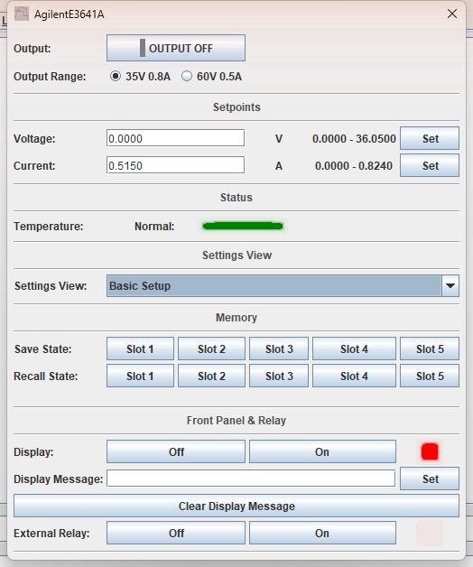
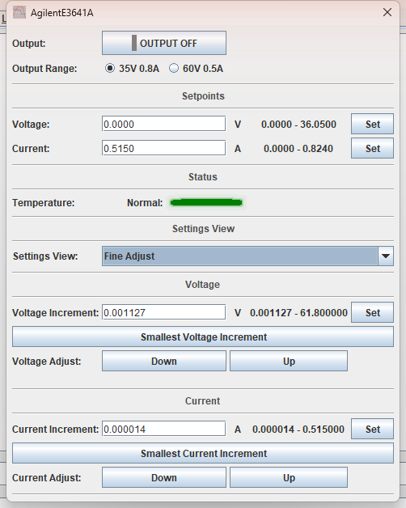
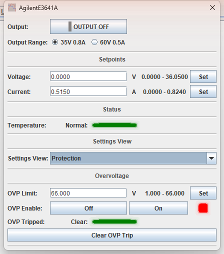
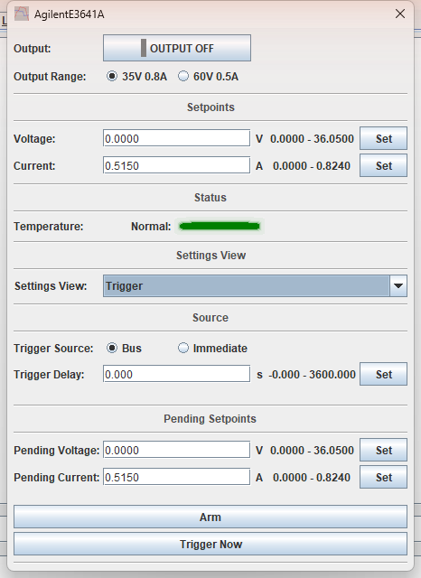
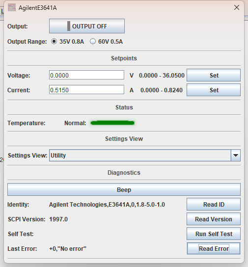

# HP / Agilent / Keysight E364xA DC Power Supplies

TestController driver for the **E3640A**, **E3641A**, **E3642A**, **E3643A**, **E3644A**
and **E3645A** — the single-output, dual-range bench supplies in the E3640A family
(30 W, 50 W and 80 W tiers).

Verified against an **E3641A** (firmware 1.8-5.0-1.0) over GPIB, page by page, with the
output run into an electronic load for the constant-voltage / constant-current pass. Both
range ceilings and the finest step were read back from the hardware rather than copied
from the data sheet.

| | |
| --- | --- |
| **Driver** | [`HP_Agilent_E364xA.txt`](HP_Agilent_E364xA.txt) |
| **Revision** | 1.2 |
| **Interface** | GPIB, RS-232 |
| **Instrument notes** | [`instrument-notes.md`](instrument-notes.md) |

| Model | Low range | High range | Tier |
| --- | --- | --- | --- |
| E3640A | 8 V / 3 A | 20 V / 1.5 A | 30 W |
| E3641A | 35 V / 0.8 A | 60 V / 0.5 A | 30 W |
| E3642A | 8 V / 5 A | 20 V / 2.5 A | 50 W |
| E3643A | 35 V / 1.4 A | 60 V / 0.8 A | 50 W |
| E3644A | 8 V / 8 A | 20 V / 4 A | 80 W |
| E3645A | 35 V / 2.2 A | 60 V / 1.3 A | 80 W |

Only the **E3641A** figures have been confirmed on hardware. The other five models are
manual-derived and have not yet been checked against a physical unit — reports welcome.

The dual-output **E3646A–E3649A** are a different instrument (two independently
addressable outputs) and are not covered here.

---

## The Setup dialog

Everything you touch while the supply is running — the output, the range and the two
setpoints — sits at the top of the dialog and never moves. Below it, a **Settings View**
dropdown swaps one of five panels into the space underneath.

The top strip is the whole working set:

- **Output** is a single button showing the state it is in, the way the instrument's own
  output key does — grey for off, green for on. One click toggles it.
- **Output Range** picks the low or high range. Changing it switches the output off
  first, so a low-range high-current setup is never carried into high-range voltage.
- **Voltage** and **Current** are the live setpoints. The supply holds the voltage until
  the load reaches the current limit, then crosses into constant current by itself.
- **Temperature** lights red on an overtemperature shutdown, green otherwise.

**The ceilings beside each setpoint follow the selected range.** On the E3641A's 35 V
range they read `0.0000 - 36.0500` and `0.0000 - 0.8240`; switching to the 60 V range
rewrites them to `0.0000 - 61.8000` and `0.0000 - 0.5150`. This matters because on the
low range the supply does **not** enforce its own ceiling — it will accept 40 V on the
35 V range without complaint. The high range's ceiling *is* enforced. See
[`instrument-notes.md`](instrument-notes.md).

Changing the Settings View sends nothing to the supply — it is a client-side choice of
which panel to draw, and the dialog opens on Basic Setup.

---

## Basic Setup

The panel the dialog opens on. Two groups that belong to no particular task:

**Memory** — five nonvolatile state slots (`*SAV` / `*RCL` 1–5, versus three on the
E363xA). A stored state carries the voltage, current, range, output state, protection,
trigger, display and step settings, so recalling one can switch the output **on**; the
driver re-reads the output state and both setpoints after a recall so the dialog cannot
show a stale picture.

**Front Panel & Relay** — turn the display off, or write up to 12 characters to it.
**Clear Display Message** blanks the panel *and* the instrument's text buffer; emptying
the buffer takes a second command, and skipping it puts the message straight back on the
next read (the reason is in [`instrument-notes.md`](instrument-notes.md)). **External
Relay** drives the optional TTL relay-control signal on the RS-232 connector.

The display is also exposed to TestController itself, so a Step or the Remote Readout
popup can write a label to it without going through this panel.

---

## Fine Adjust

The knob equivalent: set an increment, then nudge the live setpoint with Down/Up.
**Smallest Voltage Increment** and **Smallest Current Increment** drop straight to the
instrument's finest resolution — on an E3641A that is 0.001127 V and 0.0000145 A, which
is also the floor each field accepts.

The fields are named `_Increment` rather than `_Step` because they set how far one
Down/Up press moves the output, not a value to sweep. The supply refuses a Down/Up that
would leave the selected range.

---

## Protection

Overvoltage only — **the E364xA has no overcurrent protection command** (`CURR:PROT`
returns an undefined-header error), so there is no OCP threshold, enable or trip here.
The current *limit* at the top of the dialog still regulates: the supply crosses into
constant current and keeps going. Overvoltage protection **trips** — the output is
programmed to zero and fires the crowbar — so set `OVP Limit` above your working voltage
with margin.

`OVP Tripped` reads green **Clear** when nothing has tripped and red **Tripped** when
something has. Both states are lit, so an unlit indicator means the driver has not read
the value yet. Clearing a trip while the condition is still present just trips it again;
lower the setpoint or raise the threshold first.

---

## Trigger

Stage a voltage/current pair and apply it on a trigger, for a timed or synchronised step
rather than an immediate change. **Arm** issues `INIT`; with the source set to Bus the
supply then waits for **Trigger Now**, and with Immediate the pending values are applied
as soon as Arm is pressed. **Trigger Delay** sits between the trigger and the transfer,
and is ignored when the source is Immediate.

The pending setpoints follow the active range exactly as the live ones do.

---

## Utility

The beeper — useful for working out which supply on the bench you are talking to — and
the on-demand diagnostics: identity, SCPI version, self-test, and the oldest error queue
entry. These are buttons rather than continuous readouts because each query consumes what
it reads: popping the error queue removes the entry.

A query this family rejects reports its error one command **late** (a rejected query
leaves a pending response), so an error that Read Error appears to blame on a healthy
command is usually a stale entry from the command before it. See
[`instrument-notes.md`](instrument-notes.md).

---

## Logged channels

Logging scope is chosen from the **mode menu**, not from the dialog:

- **Log All** — five channels (default): `Voltage`, `Current` (`MEAS:VOLT?` /
  `MEAS:CURR?`), `VoltageSet`, `CurrentSet` (`VOLT?` / `CURR?`), and `Regulation`
  (`STAT:QUES:COND?`).
- **Log V and I only** — `Voltage` and `Current`, for when several instruments share one
  logging interval and the full five-channel cycle no longer fits.

`Regulation` catches the moment a load pulls the supply out of constant voltage into
constant current — invisible from voltage and current alone when the limit sits where the
load settles. It is logged as a **digital** channel, so the column reads `CC` or `CV`
instead of a number and the chart draws it on the shared digital scale. An output that is
off or unregulated leaves the column blank; a saved log file keeps the raw integer either
way. Details in [`instrument-notes.md`](instrument-notes.md).

Because the logging scope is a mode rather than a checkbox, TestController locks it while
a log is running, so a log's columns cannot change partway through.

---

## Installing

Copy [`HP_Agilent_E364xA.txt`](HP_Agilent_E364xA.txt) into your TestController `Devices`
folder and restart. TestController ships no driver for this family, so there is no stock
file to move aside.
