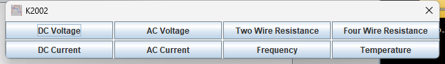
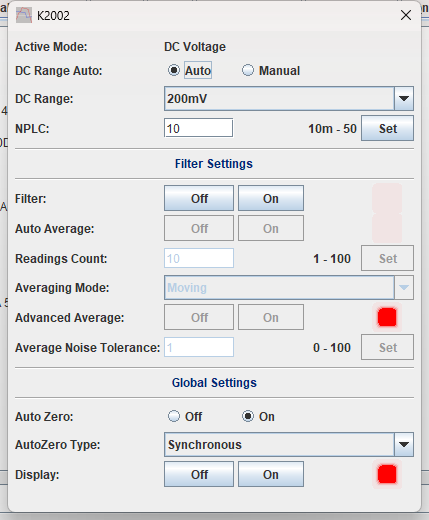
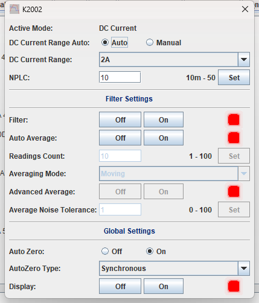
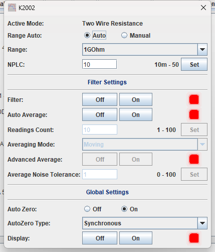
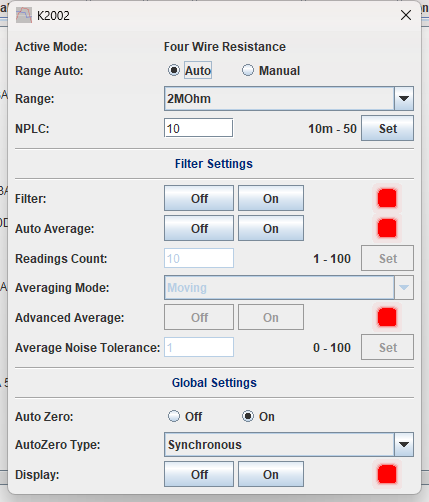
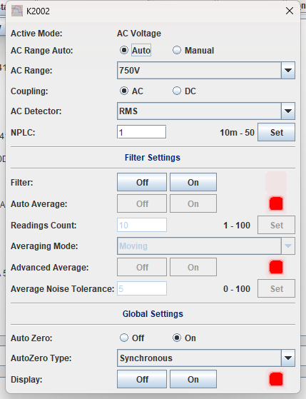
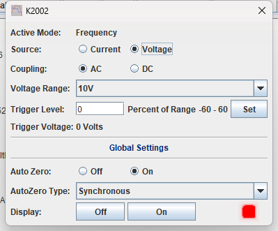
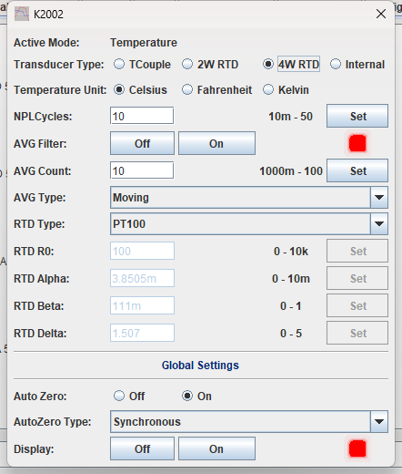

# Keithley 2001 / 2001M / 2002 Bench Multimeter

TestController driver for the **Keithley 2001**, **2001M** and **2002** bench
multimeters. One file produces three device definitions, so the meter you have is the one
that appears in the device list, with the ranges and the integration-time ceiling that
belong to it.

Eight functions, each with its own settings page reached from a selector that follows the
meter: DC volts, AC volts, DC current, AC current, 2-wire and 4-wire resistance,
frequency and temperature. Every page carries ranging, integration time and the digital
averaging filter, and one channel is logged per function.

| | |
| --- | --- |
| **Driver** | [`Keithley_200X.txt`](Keithley_200X.txt) |
| **Revision** | 1.0 |
| **Device names** | `Keithley 2001`, `Keithley 2001M`, `Keithley 2002` |
| **Interface** | GPIB |
| **Instrument notes** | [`instrument-notes.md`](instrument-notes.md) |

---

## Co-authored, and already shipped with TestController

**This driver is the work of two people.** `KungFuJosh` wrote the Keithley 20xx family
definition it grew out of; `Cyclotron` did the 2001/2002-specific work and the validation
against those two meters. The file's own `#author` tag reads `KungFuJosh & Cyclotron`, and
it is published here under both names. Josh added the second credit himself when he
submitted the file
([thread](https://www.eevblog.com/forum/testgear/program-that-can-log-from-many-multimeters/msg6318174/#msg6318174)):
*"Thanks to @Cyclotron for some heavy lifting on the 2001/2002 file. I've added him to the
`#author` credit."* Neither name belongs without the other.

The copyright follows the authorship rather than the repository. Everything else here is
`Copyright (c) 2026 Cyclotron`; this driver is **`Copyright (c) 2026 KungFuJosh and
Cyclotron`**, stated in [`LICENSE`](../../LICENSE) and again in the file's own header,
since the `.txt` is what people copy into a `Devices` folder and it travels there alone.
The MIT terms are the same either way — only the holders differ.

HKJ took the file into TestController **V3.41**, released 25 July 2026, listed there as
*"Updated: Keithley 2002, Keithley 2001M, Keithley 2001 DMM's (Thanks KungFuJosh &
Cyclotron)"*
([release post](https://www.eevblog.com/forum/testgear/program-that-can-log-from-many-multimeters/msg6318970/#msg6318970)).
If you run V3.41 or later you already have it, as `Keithley 200X.txt` in the shipped
`Devices` folder — there is nothing to install.

The copy here exists so that the file and its documentation sit in one place that does not
depend on a release archive. It is **byte-identical** to the copy V3.41 installs, checked
with `cmp` against a file taken out of that distribution; only the header comment block
differs, and the driver body has had no edit made to it here.

**Because it is shipped, it is not edited here.** A change would fork this file from the
one every other user runs, silently, because it still lints and still loads. Anything
worth changing is a request on the thread — `#name` above all, which is the key saved
setups are stored against. That includes the gaps listed at the bottom of this page: they
are reported, not fixed.

### The 2001 and 2001M are not sent the 2002's limits

The three definitions differ only in the places the hardware differs:

| | 2001 / 2001M | 2002 |
| --- | --- | --- |
| Integration time ceiling | 10 NPLC | **50 NPLC** |
| Displayed digits, DC and AC volts | 8 | **9** |
| 4-wire 200 kΩ range, value written | 210 kΩ | 200 kΩ |
| 4-wire 2 MΩ range | not offered | offered |
| Internal temperature transducer | not offered | offered |

The `Keithley 2001` and `Keithley 2001M` definitions are otherwise the same file; the two
handles exist so both `*IDN?` strings match. The 2-wire resistance table, all four
voltage and current tables, and every filter control are common to all three meters.

---

## Read this before logging with the meter

### Connecting resets the instrument

The connect sequence is `*CLS`, `*RST`, `:SYST:PRES` and then a set of defaults: one
sample per trigger, immediate trigger source, Celsius, type-K thermocouple with a
simulated 23 °C reference junction, AutoZero on, **10 NPLC on every function**, and the DC
voltage filter off. Disconnecting resets the meter again.

So whatever you set up on the front panel is gone the moment TestController connects, and
gone again when it disconnects. Configure the meter from the driver's pages, not from the
front panel, and expect the meter not to be as you left it afterwards.

### 10 NPLC is a deliberately slow default, and it sets your logging rate

Ten power-line cycles is 200 ms at 50 Hz and 167 ms at 60 Hz *per conversion*, before
AutoZero's own reference readings are added on top. The driver allows a 5 s read timeout
and 10 s for a mode change, which is generous for that.

`#askValues` is `FETC?`, which returns the **most recently completed** reading rather than
starting a new one. The meter is left free-running so there is always one to fetch — but
that also means a logging interval shorter than one conversion will fetch the same reading
twice and log it as two samples. If you need speed, lower NPLC on the pages you are using
and consider turning AutoZero off; if you need resolution, leave both alone and log slowly.

### The mode selects both the page and the column

The **`Mode_settings`** selector reads `FUNC?` and shows the settings page for whatever
function the meter is in, so the Setup dialog follows the instrument rather than the other
way round. The same mode picks which logged channel is live: only one column produces data
at a time, and switching function switches column.

`Active_Mode` at the top of the dialog is a read-only echo of the same query in plain
words, and is the fastest way to tell whether a mode change actually took.

### On the Frequency page, the trigger level is a percentage of a range the driver tracks

The instrument's threshold level is set in volts or amps, but the field here is **percent
of range**, matching how the meter's own documentation expresses it. The driver converts
using an internal variable that records the threshold range — and that variable is
updated **when the range is written from TestController**, not when it is read back. It
starts at 1 V / 1 A on connect.

So if you change the threshold range from the front panel, or connect to a meter that is
already on a different one, the percentage and the calculated `Trigger_Voltage` /
`Trigger_Current` readouts are computed against the wrong range until you set
`Voltage_Range` or `Current_Range` from the page. Set the range from the driver once and
the two agree. Full account in
[`instrument-notes.md`](instrument-notes.md#the-frequency-trigger-level-is-a-percentage-of-a-tracked-range).

---

## The function pages

Eight pages, one per function, each shown when the meter is in that function. The layout
repeats: ranging at the top, integration time under it, then a **Filter Settings** block.

The `Mode_settings` selector at the top of the dialog follows the meter — the page you
see is the function the meter is actually in — and the mode menu is how you switch it:

The DC volts page is the common shape every function repeats:

> The screenshots on this page were taken through the driver's own Setup dialog against a
> Keithley **2002** on the bench (`*IDN?` → `MODEL 2002`). They show the pages the `Keithley
> 2002` definition builds; the 2001 / 2001M definitions differ only where
> [noted above](#the-2001-and-2001m-are-not-sent-the-2002s-limits).
>
> **DC volts** has since had a cabled pass: every declared range is accepted by the meter
> and reads back unchanged, `NPLC`/filter/threshold limits match, and a supply stepped
> 0.15–24 V read back through the driver within the reference's own accuracy at every
> point — including the manual-range writes and the over-range (`∞`) path. AC, resistance,
> frequency and temperature have **not** had a cabled measurement pass. See
> [`instrument-notes.md`](instrument-notes.md#reading-a-dc-voltage--what-a-cabled-pass-showed).

### Ranging

`*_Range_Auto` switches autoranging; the range combo below it selects manually and turns
autoranging off. The two update each other.

The value written to `RANG` is **a reading the range has to be able to hold**, not a range
index — which is why the top entry of each function is written as its over-range figure
rather than its nominal name:

| Function | Ranges |
| --- | --- |
| DC volts | 200 mV, 2 V, 20 V, 200 V, 1000 V (written as 1100 V) |
| AC volts | 200 mV, 2 V, 20 V, 200 V, 750 V (written as 775 V) |
| DC and AC current | 200 µA, 2 mA, 20 mA, 200 mA, 2 A (written as 2.1 A) |
| Resistance, 2-wire | 20 Ω, 200 Ω, 2 kΩ, 20 kΩ, 200 kΩ, 2 MΩ, 20 MΩ, 200 MΩ, 1 GΩ (written as 1.05 GΩ) |
| Resistance, 4-wire | 20 Ω, 200 Ω, 2 kΩ, 20 kΩ, 200 kΩ, and 2 MΩ on the 2002 only |

| DC current | 2-wire resistance | 4-wire resistance |
| --- | --- | --- |
|  |  |  |

The 4-wire page above is the `Keithley 2002` build — the range combo carries the **2 MΩ**
entry that the 2001 / 2001M definitions remove.

### Integration time

`NPLC` runs from 0.01 to the model's ceiling — 10 on the 2001 and 2001M, 50 on the 2002.
Longer integration buys resolution and line-noise rejection and costs time; it is the
biggest single lever on how fast this meter can be logged.

### Filter Settings

Present on all six voltage, current and resistance pages, in the same shape, and each
function keeps its own settings in the instrument:

- **`Filter`** enables the digital averaging filter. Everything below it is disabled
  until it is on.
- **`Auto_Average`** lets the meter choose the filter settings. Turn it **off** to reach
  the three controls below.
- **`Readings_Count`** — 1 to 100 samples in the average.
- **`Averaging_Mode`** — `Moving` averages over a sliding window and gives a reading per
  sample; `Repeat` fills the buffer before each reading, so it divides the reading rate by
  the count.
- **`Advanced_Average`** switches to a noise-tolerance window instead of plain averaging,
  and enables **`Average_Noise_Tolerance`** (0–100 %). The filter then averages only while
  successive readings stay inside the window and restarts when one falls outside — which
  is what you want on a signal that steps.

The controls disable themselves in that dependency order, so a setting you cannot reach is
one that would not do anything.

### AC volts and AC current

Two controls beyond the common set:

- **`Coupling`** — `AC` filters the DC component out, `DC` includes it. In DC coupling the
  range has to be wide enough for the DC bias as well as the signal.
- **`AC_Detector`** — AC volts offers `RMS`, `Low_Freq_RMS`, `Average` and `Peak`; AC
  current offers `RMS` and `Average`. `Average` is calibrated for sine waves and reads
  wrong on anything else.

### Frequency

`Source` selects whether frequency is measured on the voltage or the current input, and a
sub-selector swaps in the matching threshold page — `Frequency_VOLT` or `Frequency_CURR`.
The threshold range is 1 V to 1000 V, or 1 mA to 1 A; `Trigger_Level` is −60 % to +60 % of
it, with `Trigger_Voltage` / `Trigger_Current` showing the volts or amps that works out
to. `Coupling` behaves as it does on the AC pages.

### Temperature

`Transducer_Type` chooses thermocouple, 2-wire RTD, 4-wire RTD, or — **on the 2002 only**
— the internal sensor, and swaps in the matching configuration page. The `Internal` option
above is present because this is the 2002 build; the 2001 / 2001M definitions remove it.

- **Thermocouple** (`Temperature_TC`) — types J, K, T, E, R, S, B and N; reference
  junction `Simulated` (with its temperature, 0–50 °C) or `Real` (with a coefficient and a
  0 °C offset). Only the fields belonging to the selected reference junction are enabled.
- **RTD** (`Temperature_RTD`), shared by 2-wire and 4-wire — PT100, PT385, PT3916, D100,
  F100, USER and SPRTD. `RTD_R0` is enabled for USER and SPRTD; the alpha, beta and delta
  constants for USER only.

`Temperature_Unit` selects Celsius, Fahrenheit or Kelvin. Note that the **logged column's
unit label stays `°C`** whichever you pick — the number changes, the label does not.

---

## Global controls

At the bottom of every page, under a **Global Settings** separator:

- **`Auto_Zero`** — on, the meter interleaves reference measurements to cancel thermal
  drift; off is faster and drifts. Writing it stops the trigger model, changes the setting
  and restarts it, so the reading stream pauses briefly.
- **`AutoZero_Type`** — `Normal` re-zeroes roughly every 200 ms; `Synchronous` on every
  reading, which is the slowest and the most stable.
- **`Display`** — turns the front-panel display off, which speeds up bus operation on this
  generation of meter. Useful for a long unattended log; remember it is off before you go
  looking at the front panel.

---

## Logged channels

One channel per function, and only the active function's channel produces data:

| Channel | Unit | Active in mode |
| --- | --- | --- |
| `VoltageDC` | V | DC volts |
| `VoltageAC` | V | AC volts |
| `CurrentDC` | A | DC current |
| `CurrentAC` | A | AC current |
| `Resistance` | Ohm | 2-wire **and** 4-wire resistance |
| `Frequency` | Hz | Frequency |
| `Temperature` | °C | Temperature |
| `Period` | s | *declared, but no mode selects it — see below* |

`Resistance` is shared by both resistance modes, so a log that switches between 2-wire and
4-wire keeps one column rather than splitting into two.

**`Period` is declared and unreachable in this revision.** The eight modes the driver
defines are the eight functions above, and none of them is named `Period`, so nothing ever
selects that column. It costs nothing and does nothing; if you want period rather than
frequency, that is a request to make on the thread.

The driver declares `#interfaceType DMM BMM` — a bench multimeter with electronic range
control — and exposes the generic `readValue()` scripting call, so scripts and
TestController's meter-aware features can read it without knowing which function it is in.

---

## Installing

**If you run TestController V3.41 or later, this driver is already installed** as
`Keithley 200X.txt`, and this copy is identical to it. There is nothing to do.

To use this copy anyway, put [`Keithley_200X.txt`](Keithley_200X.txt) in your
TestController `Devices` folder and **move the shipped `Keithley 200X.txt` out of it
first**. All three `#idString` values are claimed by both files and only one can win the
match, so leaving both in place gets you whichever TestController happens to load — not an
error message. Restart TestController after either change.

---

## What the driver does not have

Reported rather than fixed, because the file is shipped and changing it here would fork it
from what everyone else runs. None of these stops it working.

- **No `#eol`.** The driver leaves the line ending at the default. GPIB framing does not
  depend on it, so this is a robustness gap rather than a fault.
- **Eleven `comboboxHot` controls send non-numeric parameters without a `:string:` tag** —
  the `Moving`/`Repeat` filter controls, the thermocouple and RTD type lists, the
  reference-junction selector and `AutoZero_Type`. They work; the tag is what makes the
  read side explicitly a string rather than relying on the default.
- **`#helpurl` is not documentation.** F1 on a mode or setup page opens a joke link left
  in the file. Nothing depends on it.
- **No `#notes`.** The device list's *view* button, which is where a driver puts its
  setup guidance, has nothing to show for this one. That is what this page is for.
- **The `Temperature` column's unit is fixed at `°C`** regardless of `Temperature_Unit`,
  and `°C` is not one of the standard unit strings.
- **The `buttonsOn` indicator lamps do not track state.** On every filter page the small
  lamp beside `Filter` / `Auto_Average` / `Advanced_Average` (and `AVG_Filter` on the
  temperature page, and `Display` in Global Settings) sits red regardless of whether the
  control is on or off — see the screenshots above. The buttons themselves read and write
  correctly; only the lamp is cosmetic. On a freshly connected meter the lamps can also
  come up half-painted before the first mode change.
- **The range combo display lags while autoranging is on.** When `*_Range_Auto` is `Auto`
  and the meter changes range by itself, the range combo keeps showing the previous range
  until the page is refreshed (touch `Auto`/`Manual`, change mode, or reopen the dialog).
  Readings are unaffected — only the displayed range. Details in
  [`instrument-notes.md`](instrument-notes.md#reading-a-dc-voltage--what-a-cabled-pass-showed).
