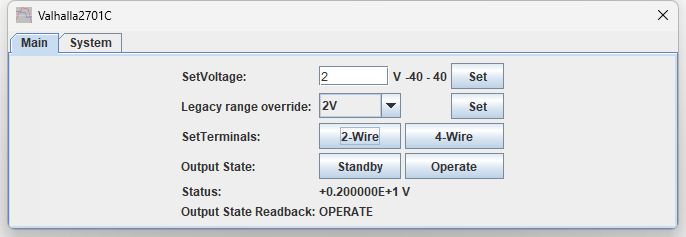
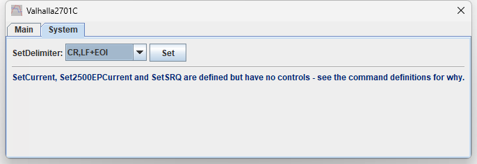

# Valhalla Scientific 2701C Programmable DC Voltage Calibrator

TestController driver for the **Valhalla Scientific 2701C**, a programmable DC voltage /
current calibrator, and the closely related 2701B. Requires the Option TL-3 IEEE-488
interface.

Verified against a 2701C (Option LNF) over a Prologix GPIB-Ethernet gateway, with the
output measured by a Keithley 2002 8½-digit DMM. Commanded setpoints measured **1.0 V →
1.00000654 V**, **2 V → 1.99994723 V**, **10 V → 9.9998045 V**; STANDBY drops the output to
a few µV.

| | |
| --- | --- |
| **Driver** | [`Valhalla_2701C.txt`](Valhalla_2701C.txt) |
| **Revision** | 1.0 |
| **Interface** | GPIB (Option TL-3) |
| **Instrument notes** | [`instrument-notes.md`](instrument-notes.md) |

---

## Main page

`SetVoltage` takes the output level in volts in free format — `1.1234`, `-10`, `1.5E-3`.
The instrument auto-ranges, including down to the 200 mV range, so this one field covers
every range. Setting a level also puts the instrument into **OPERATE**; there is no way to
program a level while staying in standby.

The field is bounded at ±40 V for the LNF option. Entering more turns it red and the write
is refused rather than sent.

`Legacy range override` forces a range with the old `R` command. It is not needed —
`SetVoltage` auto-ranges and supersedes it — and it cannot reach the 200 mV range at all. It
is here for completeness with earlier 2701-series units.

`SetTerminals` selects 2-wire or 4-wire. There is no remote query for which mode is
active, so this control shows what it last wrote and the front-panel indicator is the only
ground truth.

`Output State` forces STANDBY or OPERATE. Most commands select OPERATE on their own, so
this is mainly how you turn the output off.

`Status` shows the raw status word and `Output State Readback` decodes its
OPERATE/STANDBY flag. Both refresh whenever a control writes, and on a 2 s timer while the
dialog is open, so front-panel changes cannot leave them stale.

> **The logged level is a setpoint, not a measurement.** The status word reports what the
> calibrator is programmed to and is unchanged by STANDBY. `Output State Readback` is the
> field that tells you whether the output is actually live.

## System page

`SetDelimiter` selects the reply framing. The driver sets `CR,LF+EOI` on connect, so this
normally needs no attention.

The 120 mA current source (`SetCurrent`), the 2500EP/IRP current-range programming
(`Set2500EPCurrent`) and the SRQ enable (`SetSRQ`) are defined as commands and can be used
from the command line, but have no controls. The first two are optional hardware that was
not present to test against; the third is deliberate, because the driver's own status read
would immediately undo it.

---

## Installing

Copy [`Valhalla_2701C.txt`](Valhalla_2701C.txt) into your TestController `Devices` folder
and restart.

**This instrument cannot be auto-detected.** It has no `*IDN?` — any read returns its
status word instead — so the driver uses TestController's `Ascii` driver, which connects
without identifying the device. Add it manually on the *Load devices* page with the GPIB
address set on the instrument's rear DIP switches.

One consequence worth knowing: because nothing is verified at connect, TestController will
report this device as present even if the address is empty or the instrument is switched
off. A device that shows as connected is not evidence that it is switched on — read the
status word.
